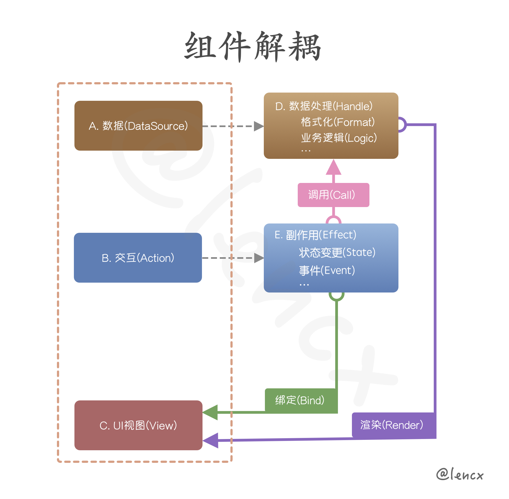

# 组件解耦

> 自前端三大框架([Vue](https://vuejs.org), [React](https://reactjs.org), [Angular](https://angular.io))以及后起之秀[Svelte](https://svelte.dev)出现之后，各种组件，轮子。大家都没少造过，一些大公司或者有精力的人，也在研究着`low code`或`no code`，有了一些落地或者具体方案。

## 背景

但就我自身经历及接触项目而言，项目还是停留在如何编写组件的层次上，简单的实现一些复用。一些历史项目因为需求的迭代，功能在不断增加，写代码的人员也在不断更替，交接。就会导致最后的接手项目的人痛苦不堪，~~重构？不现实，时间不够，之前的需求也不清楚。继续保持？就面临着怎么去在原项目之上继续迭代。~~ 进退两难。。。

在之前的需求毫不知情的情况下，如何完成需求功能的迭代，UI改版？只能通过全局搜索一些关键词，关键字去一步步向上debug源码。如果代码中牵扯过多的业务逻辑，就完全懵逼了，👻知道之前的需求是什么呀 ?_?!!!

以React为例，因为每个人都有自己对组件的理解，不同的人站在不同的维度去封装，就导致最后的项目结构，代码结构也是千差万别。

* `无状态组件`: 不涉及过多状态交互，很容易实现，大家的思路都差不多。
* `有状态组件`: 一旦涉及到状态，业务逻辑，交互。一个组件就变得不再可控。每个人的风格也都体现的淋漓尽致！
  * 组件内发起请求，各种请求，大量接口相互依赖。如果涉及到多个接口并行，后一个接口依赖上一个接口的返回值，写法又是各有特色。
  * 出现大量的业务逻辑分支，根据业务`return`出不同的组件╥﹏╥
  * 直接在组件内实现一个或多个子组件(ノへ￣、)
  * 子组件上挂载着大量的`props`，属性有时候多到令人发指，有数据，方法，状态，自定义的xxx，各种传递。 o(╥﹏╥)o
  * 欢迎大家继续补充吐槽...

## 思考

我对数据的理解，它既贴近于业务层，也耦合着交互层，如果不能很好的分离组织这三层，很可能牵一发而动全身。所以数据是核心，既是业务的核心，也是组件的核心。

* 数据，业务逻辑，交互都会影响最终需要渲染的UI视图。
* 编写组件时，首先分析业务需求，对组件进行分层。大致分为`数据(DataSource)`，`交互(Action)`，`UI视图(View)`三层。
  * **数据处理(Handle)**: 承载着核心业务逻辑，对数据进行格式化输出，供UI组件进行标准化接收，一般以`function`形式存在。
  * **副作用(Effect)**: 以我目前接触到的场景，主要还是以事件修改组件状态，更新数据及UI视图为主。所以事件及状态变更可能会同时出现在`数据处理`和`UI视图`中。在数据处理中，`调用(Call)`方法；在UI中，`绑定(Bind)`事件及状态。UI层尽量不直接处理或少处理源数据。



## 举例

* 业务中常会有这样一种需求，用户可以动态的新增删除一个列表，因为每次需要处理的数据，和展示的UI形式都是不确定的。可能我们每次做需求时都实现一次代码，或者把新增和删除方法提取出来，实现部分复用。以`React Hook`为例：

::: details Hooks: useDataOP

```js
/* hooks/useDataOP.js */
import { useState, useEffect } from 'react';
import { v4 as uuidv4 } from 'uuid';
import cloneDeep from 'lodash/cloneDeep';

// 使用Symbol作为数据的唯一key
const safeKey = Symbol('tid');

// 格式化源数据
const opFmtData = (data) => {
  return cloneDeep(data).map((i) => {
    i[safeKey] = uuidv4();
    return i;
  });
};

/**
 * useDataOP
 * @author lencx
 * @param rawData - 源数据
 */
export default function useDataOP(rawData = []) {
  const [opData, setData] = useState([]);
  const [opType, setType] = useState(null);
  const [isOk, setOk] = useState(true);

  // 数据初始化
  useEffect(() => {
    if (Array.isArray(rawData)) {
      if (rawData.length > 0) {
        const data = opFmtData(rawData);
        setData(data);
      }
      setOk(true);
    } else {
      setOk(false);
    }
    // eslint-disable-next-line react-hooks/exhaustive-deps
  }, []);

  if (!isOk) return console.error('Parameter must be an array!');

  /**
   * 新增
   * @param data - 新增的数据对象
   */
  const opAdd = (data = {}) => {
    const result = [...opData, { [safeKey]: uuidv4(), ...data }];
    setData(result);
    setType('add');
    return result;
  };

  /**
   * 删除
   * @param value - 需要删除的值，如果为字符串或数字时，需要配合key使用。
   *   如果value为对象，则为需要删除的记录，通过safeKey查找删除。
   * @param key - 默认为id，选填，可省略
   */
  const opRemove = (value, key = 'id') => {

    let result;
    if (typeof value === 'string' || typeof value === 'number') {
      result = opData.filter((i) => i[key] !== value);
    } else {
      result = opData.filter((i) => i[safeKey] !== value[safeKey]);
    }
    setData(result);
    setType('remove');
    return result;
  };

  /**
   * 排序
   * @param startIndex - 当前位置
   * @param endIndex - 目标位置
   */
  const opReorder = (startIndex, endIndex) => {
    const result = Array.from(opData);
    const [removed] = result.splice(startIndex, 1);
    result.splice(endIndex, 0, removed);
    setData(result);
    setType('reorder');
    return result;
  };

  return {
    opData,
    opType,
    opAdd,
    opRemove,
    opReorder,
    opRawData: rawData,
    opSafeKey: safeKey,
  };
}
```

```jsx
// 使用useDataOP
import React, { useState } from 'react';
import useDataOP from '@/hooks/useDataOP';

export default () => {
  const { opData, opAdd, opRemove, opReorder } = useDataOP([]);
  const [count, setCount] = useState(1);

  const handleAdd = () => {
    setCount(count+1);
    opAdd({ name: `test${count}` });
  }
  return (
    <div>
      <button onClick={handleAdd}>Add</button>
      {opData.map((i, idx) => {
        return (
          <div>
            <span>Name: {i.name}</span>
            {' '}
            <button onClick={() => opRemove(i)}>Remove</button>
            <button onClick={() => opReorder(idx, idx-1)}>Up+1</button>
            <button onClick={() => opReorder(idx, idx+1)}>Down-1</button>
          </div>
        )
      })}
    </div>
  );
}
```

:::

## 总结

数据与UI的解耦，其实就意味着业务逻辑与UI组件视图的解耦。当组件要跨平台，或者UI大换肤时，我们只需要实现标准的数据接收组件就可以了。业务功能对应的其实就是一个个数据处理函数和UI组件的组合，通过事件去触发或者绑定一些状态。当数据处理或组件不满足需求的时候，我们只需要去扩展对应的函数或组件。

## 相关链接

### Low Code

* [awesome-lowcode](https://github.com/taowen/awesome-lowcode): 国内低代码平台从业者交流
* [JSX Lite](https://github.com/BuilderIO/jsx-lite): Write components once, run everywhere. Compiles to Vue, React, Solid, and Liquid. Import code from Figma and Builder.io
